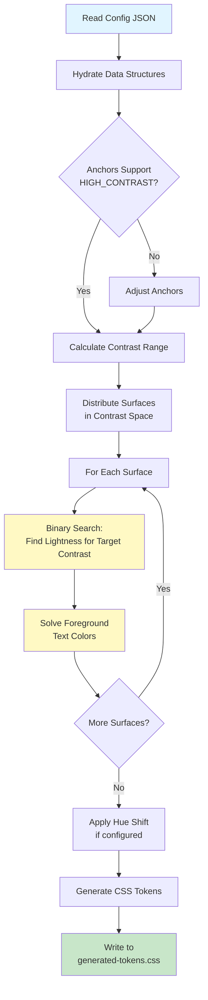

# Surface Lightness Solver Architecture

This document explains the architecture, goals, and implementation details of the `surface-lightness-solver.ts` script. It is intended to help developers understand how the color system is generated and why certain implementation choices were made.

## 1. High-Level Goal

The primary goal of this solver is to **automate accessibility and consistency**. Instead of manually picking hex codes for every surface and text color in both light and dark modes, we define **constraints** and **relationships**, and the solver calculates the precise values that satisfy them.

**Key Philosophy:**

- **Intent over Value:** We declare "I want a surface that supports strong text" (Intent), not "I want `#f0f0f0`" (Value).
- **Perceptual Contrast (APCA):** We use the APCA algorithm (Advanced Perceptual Contrast Algorithm) instead of WCAG 2.x, as it better models how human vision perceives contrast, especially with different font weights and polarities.
- **Contrast Space Distribution:** Surfaces are distributed based on their _contrast_ relative to the text, not just linear lightness.

## 2. Core Concepts

### Polarity

The system divides the world into two "polarities":

- **Page (`page`)**: The standard "positive" polarity.
  - _Light Mode_: Light background, dark text.
  - _Dark Mode_: Dark background, light text.
- **Inverted (`inverted`)**: The "negative" polarity, often used for sidebars, tooltips, or spotlight areas.
  - _Light Mode_: Dark background, light text.
  - _Dark Mode_: Light background, dark text (or lighter dark).

### Anchors

Anchors define the **dynamic range** available for surfaces. They are the "bookends" of the lightness scale.

- **Start**: The background lightness of the "base" surface (e.g., the page body).
- **End**: The lightness of the most elevated surface.
- **Adjustable**: Some anchors are marked `adjustable`. The solver is allowed to shift these values if necessary to guarantee that `HIGH_CONTRAST` text is possible.

### Surfaces

A "Surface" is a semantic layer (e.g., `surface-page`, `surface-card`, `surface-sidebar`).

- **Slug**: The CSS class name suffix.
- **Polarity**: Which world it belongs to.
- **Contrast Offset**: A manual tweak to shift a surface lighter or darker relative to its calculated position in the sequence.

## 3. The Solver Pipeline

The script follows a linear pipeline to generate the final CSS.

### Step 1: Hydration & Config

It reads `surface-lightness.config.json` and hydrates it into typed objects (`AnchorValue`, `ModeAnchors`, etc.). This ensures we are working with valid data structures.

### Step 2: Anchor Adjustment

Before solving for specific surfaces, the script checks if the defined anchors allow for **High Contrast** text.

- If an anchor is `adjustable` and the initial range doesn't support the target contrast (e.g., 108 APCA), the solver moves the anchor until it does.
- _Why?_ This guarantees that our base assumptions (like "the page background") are actually accessible before we build on top of them.

### Solver Pipeline Overview



### Step 3: Sequence Solving (The "Contrast Space" Logic)

This is the most sophisticated part of the system.

1.  **Delta Calculation**: It calculates the total available contrast range between the `Start` and `End` anchors.
2.  **Distribution**: It divides this range by the number of surfaces to find a "step" size.
3.  **Targeting**: For each surface, it calculates a **Target Contrast** based on its index in the list (plus any `contrastOffset`).
4.  **Solving**: It uses a **Binary Search** to find the exact lightness value (0-1) that yields that specific Target Contrast against the text color.

> **Note:** This means surfaces are spaced evenly by _how much they contrast with text_, not by _how much light they emit_. This ensures a perceptually consistent rhythm.

### Step 4: Foreground Solving

Once a surface's background lightness is fixed, the solver calculates the text colors that sit _on top_ of it.

- It solves for multiple "bands" of contrast:
  - **Strong**: Primary text (Target: ~105 APCA).
  - **Subtle**: Secondary text (Target: ~90 APCA).
  - **Subtler**: Tertiary/Disabled text (Target: ~75 APCA).
- It again uses Binary Search to find the foreground lightness that hits these targets exactly.

### Step 5: Token Generation

Finally, it writes the results to `css/generated-tokens.css`.

- **Format**: It uses the modern `light-dark()` CSS function and `oklch()` color space.
  ```css
  --lightness-surface-page: light-dark(oklch(0.98 0 0), oklch(0.12 0 0));
  ```
- **Why OKLCH?**: It is perceptually uniform and allows us to decouple Lightness (L) from Chroma (C) and Hue (H), which is critical for this system where we solve for L but apply C and H via utility classes.

## 4. Implementation Critique

### Strengths

- **Robustness**: The binary search approach ensures we hit our accessibility targets regardless of the background color.
- **Flexibility**: Changing a single anchor value ripples through the entire system, updating all surfaces to maintain their relative relationships.
- **Modernity**: The output is cutting-edge CSS (Baseline 2025).

### Potential "Weirdness" / Overheads

- **Binary Search Iterations**: The solver runs a binary search (36-80 iterations) for _every_ surface and _every_ text color. This is computationally expensive. While fine for a build script, it would be too slow for a runtime client-side theme generator.
- **Linear Contrast Assumption**: The assumption that "even distribution of contrast" is the best aesthetic choice is a strong opinion. Sometimes, visual hierarchy requires non-linear steps (e.g., a big jump for a modal, small jumps for cards). The `contrastOffset` property is the escape hatch for this.
- **Complexity**: The code defines many classes (`AnchorValue`, `ModeAnchors`) just to wrap simple numbers. This adds verbosity but helps manage the mental model of "Start/End" vs. "Light/Dark".

## 5. Integration with CSS

The solver’s job is to determine the _Lightness_ values that satisfy contrast targets.

In practice, the CLI produces a single generated stylesheet (commonly `theme.css`) that contains:

- The solved lightness tokens (e.g. `oklch(L 0 0)`), plus the semantic token surface.
- The semantic classes (e.g. `.surface-card`, `.text-strong`) that consume those tokens.

Hue and chroma are applied in CSS using relative color syntax; the solver doesn’t “pick” hues, it solves for lightness and contrast.

This separation of concerns (Solver = Lightness/Contrast, CSS = Hue/Chroma application) is the architectural keystone of the system.
